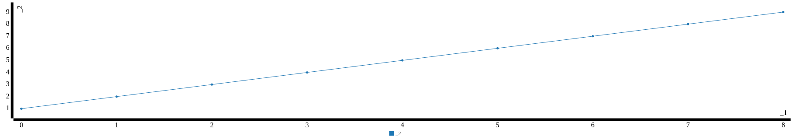
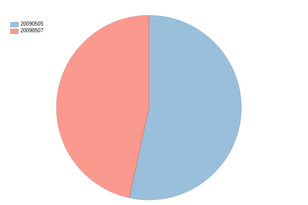

```scala
// TODO: Replace <FILL IN> with appropriate code
val data = 1 to 10000
print(data)
```


><pre>
> Range(1, 2, 3, 4, 5, 6, 7, 8, 9, 10, 11, 12, 13, 14, 15, 16, 17, 18, 19, 20, 21, 22, 23, 24, 25, 26, 27, 28, 29, 30, 31, 32, 33, 34, 35, 36, 37, 38, 39, 40, 41, 42, 43, 44, 45, 46, 47, 48, 49, 50, 51, 52, 53, 54, 55, 56, 57, 58, 59, 60, 61, 62, 63, 64, 65, 66, 67, 68, 69, 70, 71, 72, 73, 74, 75, 76, 77, 78, 79, 80, 81, 82, 83, 84, 85, 86, 87, 88, 89, 90, 91, 92, 93, 94, 95, 96, 97, 98, 99, 100, 101, 102, 103, 104, 105, 106, 107, 108, 109, 110, 111, 112, 113, 114, 115, 116, 117, 118, 119, 120, 121, 122, 123, 124, 125, 126, 127, 128, 129, 130, 131, 132, 133, 134, 135, 136, 137, 138, 139, 140, 141, 142, 143, 144, 145, 146, 147, 148, 149, 150, 151, 152, 153, 154, 155, 156, 157, 158, 159, 160, 161, 162, 163, 164, 165, 166, 167, 168, 169, 170, 171, 172, 173, 174, 175, 176, 177, 178, 179, 180, 181, 182, 183, 184, 185, 186, 187, 188, 189, 190, 191, 192, 193, 194, 195, 196, 197, 198, 199, 200, 201, 202, 203, 204, 205, 206, 207, 208, 209, 210, 211, 212, 213, 214, 215, 216, 217, 218, 219, 220, 221, 222, 223, 224, 225, 226, 227, 228, 229, 230, 231, 232, 233, 234, 235, 236, 237, 238, 239, 240, 241, 242, 243, 244, 245, 246, 247, 248, 249, 250, 251, 252, 253, 254, 255, 256, 257, 258, 259, 260, 261, 262, 263, 264, 265, 266, 267, 268, 269, 270, 271, 272, 273, 274, 275, 276, 277, 278, 279, 280, 281, 282, 283, 284, 285, 286, 287, 288, 289, 290, 291, 292, 293, 294, 295, 296, 297, 298, 299, 300, 301, 302, 303, 304, 305, 306, 307, 308, 309, 310, 311, 312, 313, 314, 315, 316, 317, 318, 319, 320, 321, 322, 323, 324, 325, 326, 327, 328, 329, 330, 331, 332, 333, 334, 335, 336, 337, 338, 339, 340, 341, 342, 343, 344, 345, 346, 347, 348, 349, 350, 351, 352, 353, 354, 355, 356, 357, 358, 359, 360, 361, 362, 363, 364, 365, 366, 367, 368, 369, 370, 371, 372, 373, 374, 375, 376, 377, 378, 379, 380, 381, 382, 383, 384, 385, 386, 387, 388, 389, 390, 391, 392, 393, 394, 395, 396, 397, 398, 399, 400, 401, 402, 403, 404, 405, 406, 407, 408, 409, 410, 411, 412, 413, 414, 415, 416, 417, 418, 419, 420, 421, 422, 423, 424, 425, 426, 427, 428, 429, 430, 431, 432, 433, 434, 435, 436, 437, 438, 439, 440, 441, 442, 443, 444, 445, 446, 447, 448, 449, 450, 451, 452, 453, 454, 455, 456, 457, 458, 459, 460, 461, 462, 463, 464, 465, 466, 467, 468, 469, 470, 471, 472, 473, 474, 475, 476, 477, 478, 479, 480, 481, 482, 483, 484, 485, 486, 487, 488, 489, 490, 491, 492, 493, 494, 495, 496, 497, 498, 499, 500, 501, 502, 503, 504, 505, 506, 507, 508, 509, 510, 511, 512, ... )data: scala.collection.immutable.Range.Inclusive = Range(1, 2, 3, 4, 5, 6, 7, 8, 9, 10, 11, 12, 13, 14, 15, 16, 17, 18, 19, 20, 21, 22, 23, 24, 25, 26, 27, 28, 29, 30, 31, 32, 33, 34, 35, 36, 37, 38, 39, 40, 41, 42, 43, 44, 45, 46, 47, 48, 49, 50, 51, 52, 53, 54, 55, 56, 57, 58, 59, 60, 61, 62, 63, 64, 65, 66, 67, 68, 69, 70, 71, 72, 73, 74, 75, 76, 77, 78, 79, 80, 81, 82, 83, 84, 85, 86, 87, 88, 89, 90, 91, 92, 93, 94, 95, 96, 97, 98, 99, 100, 101, 102, 103, 104, 105, 106, 107, 108, 109, 110, 111, 112, 113, 114, 115, 116, 117, 118, 119, 120, 121, 122, 123, 124, 125, 126, 127, 128, 129, 130, 131, 132, 133, 134, 135, 136, 137, 138, 139, 140, 141, 142, 143, 144, 145, 146, 147, 148, 149, 150, 151, 152, 153, 154, 155, 156, 157, 158, 159, 160, 161, 162, 163, 164, 165, 166, 167, 168, 169, 170...
> <pre>


```scala
// TODO: Replace <FILL IN> with appropriate code
val distData = sc.parallelize(data)
print(distData)
```


><pre>
> ParallelCollectionRDD[0] at parallelize at <console>:80distData: org.apache.spark.rdd.RDD[Int] = ParallelCollectionRDD[0] at parallelize at <console>:80
> <pre>


```scala
val x = distData.filter(s=>s<10)
x.collect()
```


><pre>
> x: org.apache.spark.rdd.RDD[Int] = MapPartitionsRDD[1] at filter at <console>:81
> res6: Array[Int] = Array(1, 2, 3, 4, 5, 6, 7, 8, 9)
> <pre>

> 

> 

> 


```scala
val pagecounts = sc.textFile("/home/akash/kth/data_intensive/labs/id2221/lab2/data/pagecounts/*")
print(pagecounts)
```


><pre>
> /home/akash/kth/data_intensive/labs/id2221/lab2/data/pagecounts/* MapPartitionsRDD[1] at textFile at <console>:77pagecounts: org.apache.spark.rdd.RDD[String] = /home/akash/kth/data_intensive/labs/id2221/lab2/data/pagecounts/* MapPartitionsRDD[1] at textFile at <console>:77
> <pre>


```scala
for (x <-pagecounts.take(2)) {
   println(x)
}
```


><pre>
> 20090505-000000 aa Main_Page 2 9980
> 20090505-000000 ab %D0%90%D0%B8%D0%BD%D1%82%D0%B5%D1%80%D0%BD%D0%B5%D1%82 1 465
> <pre>


```scala
pagecounts.count()
```


><pre>
> res8: Long = 1398882
> <pre>


```scala
val enPages = pagecounts.filter(s => s.split("\\s")(1)=="en").cache()
```


><pre>
> enPages: org.apache.spark.rdd.RDD[String] = MapPartitionsRDD[6] at filter at <console>:79
> <pre>


```scala
enPages.count()
```


><pre>
> res27: Long = 970545
> <pre>


```scala

val enTuples = enPages map(s=>{
  var fields = s.split("\\s")
  (fields(0).substring(0,8),fields(3).toInt)
})

//check with Amir 2 unique dates only
val enKeyValuePairs = enTuples
```


><pre>
> enTuples: org.apache.spark.rdd.RDD[(String, Int)] = MapPartitionsRDD[16] at map at <console>:84
> enKeyValuePairs: org.apache.spark.rdd.RDD[(String, Int)] = MapPartitionsRDD[16] at map at <console>:84
> <pre>


```scala
enKeyValuePairs.reduceByKey((views1,views2)=> views1+views2).collect()
```


><pre>
> res108: Array[(String, Int)] = Array((20090507,6175726), (20090505,7076855))
> <pre>

> 

> 


```scala
enPages.map(s=>{
  var fields = s.split("\\s")
  (fields(0).substring(0,8),fields(3).toInt)
}).reduceByKey((views1,views2)=> views1+views2, 1).collect()

```


><pre>
> res111: Array[(String, Int)] = Array((20090507,6175726), (20090505,7076855))
> <pre>

> 

> 


```scala
//check With Amir order of filter and reduce
enPages.map(x => x.split(" ")).map(s=> (s(2),s(3).toInt))
.reduceByKey((views1,views2)=> views1+views2, 40).filter(viewTuple=> viewTuple._2 > 200000).map(x => (x._2, x._1)).collect()
```


><pre>
> res117: Array[(Int, String)] = Array((468159,Special:Search), (451126,Main_Page), (1066734,404_error/))
> <pre>
